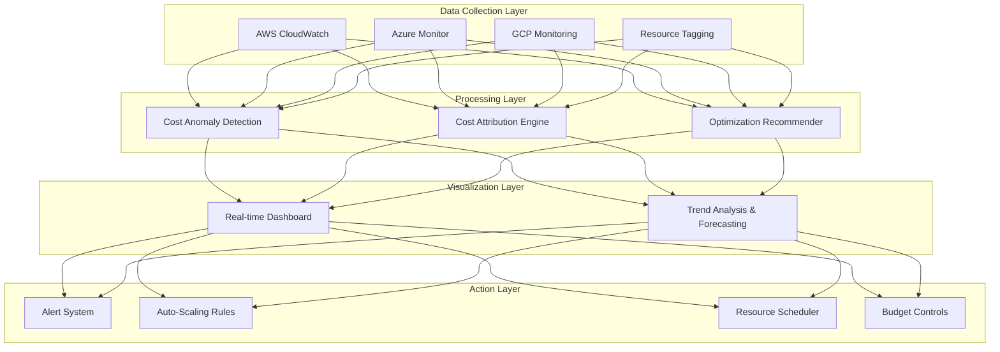
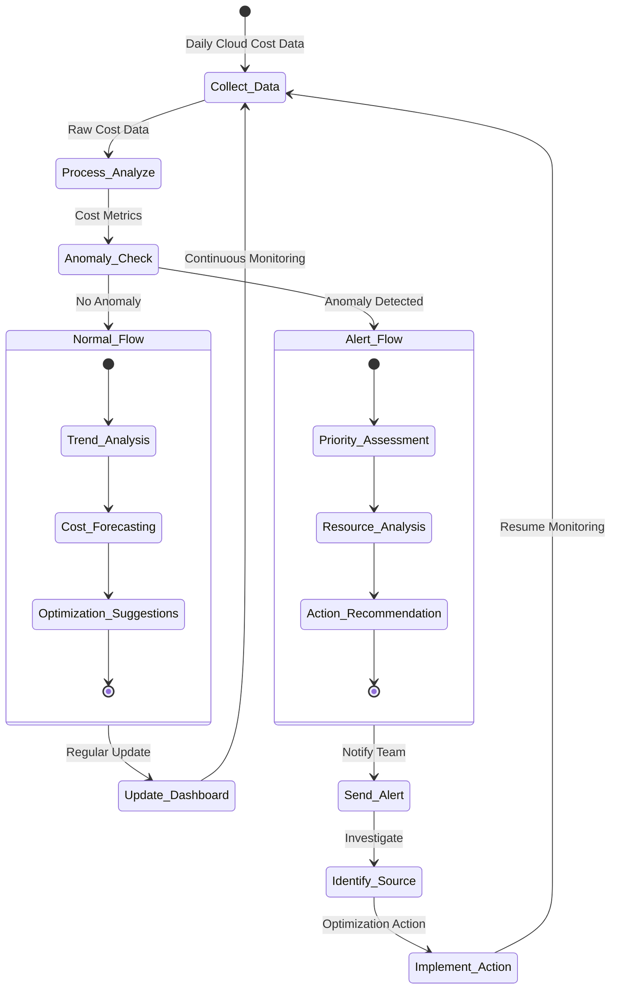
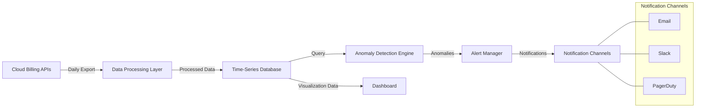
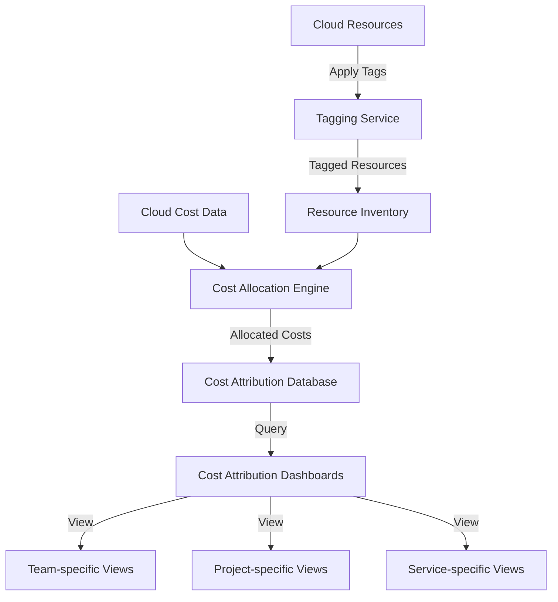
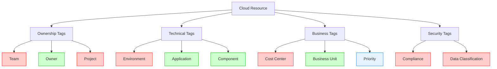
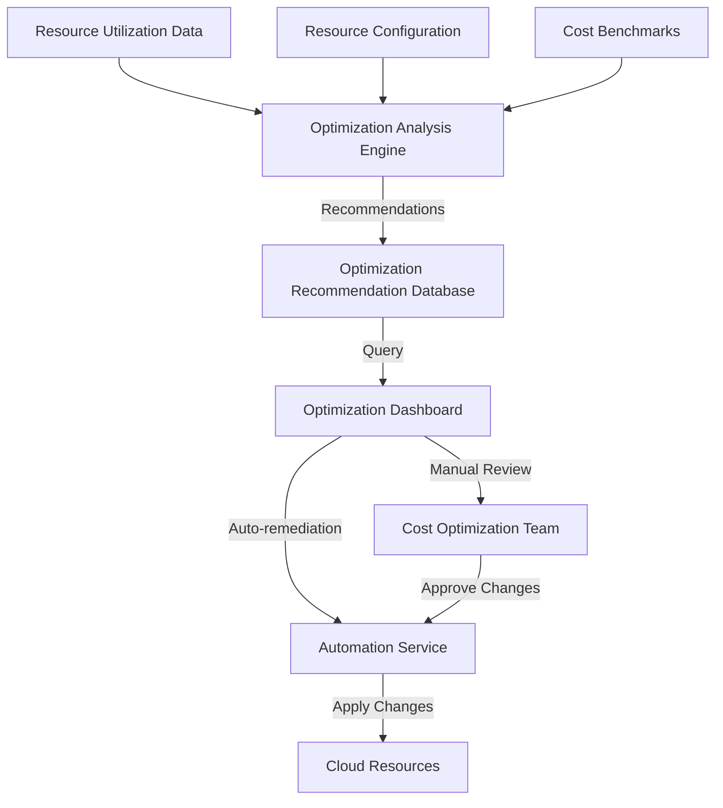
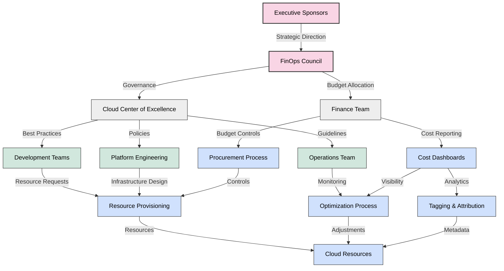
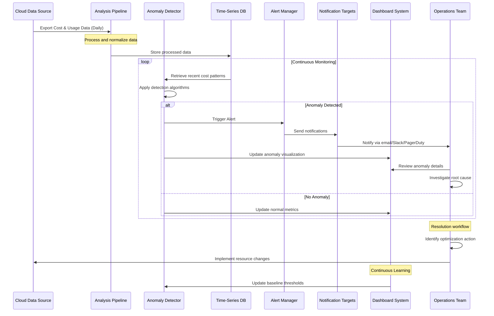
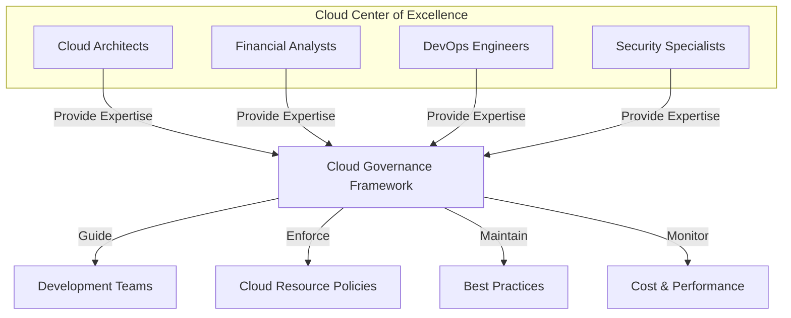
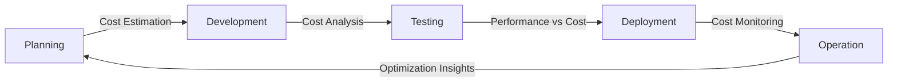

# Atlan Cloud Cost Management 

## Problem Statement

Atlan is facing three interconnected challenges with cloud costs:

1. **Delayed Detection**: Currently, there's a significant lag between when cost increases occur and when the team becomes aware of them. By the time cost issues are identified, substantial unnecessary spending has already occurred. 

2. **Source Identification**: When cost increases are eventually detected, the team struggles to identify the exact sources. This creates a "guessing game" situation where engineers must manually investigate various services, projects, and resources to determine what's driving the cost increase

3. **Optimization Pathways**: Even after identifying cost sources, there's no clear methodology for determining which optimizations would yield the highest savings with the least effort. This makes cost optimization more of an ad-hoc process than a systematic approach.

## Proposed Solution Overview

### High-Level Architecture

The proposed architecture consists of four distinct layers:

1. **Data Collection Layer**:
   - **AWS CloudWatch**: Captures detailed AWS resource metrics and usage data
   - **Azure Monitor**: Collects Azure resource performance and cost data
   - **GCP Monitoring**: Gathers Google Cloud resource metrics and billing information
   - **Resource Tagging**: Implements a consistent tagging strategy across all cloud resources

2. **Processing Layer**:
   - **Cost Anomaly Detection**: Analyzes cost patterns to identify unusual spikes or trends
   - **Cost Attribution Engine**: Maps costs to specific teams, projects, and applications
   - **Optimization Recommender**: Suggests cost-saving measures based on usage patterns

3. **Visualization Layer**:
   - **Real-time Dashboard**: Provides up-to-date cost visibility across all cloud platforms
   - **Trend Analysis & Forecasting**: Predicts future costs and highlights concerning trends

4. **Action Layer**:
   - **Alert System**: Notifies relevant stakeholders of cost anomalies
   - **Auto-Scaling Rules**: Automatically adjusts resources based on demand
   - **Resource Scheduler**: Manages non-production resources during off-hours
   - **Budget Controls**: Enforces spending limits and approval workflows

### Process Flow

The process flow has two main paths:

**Normal Flow**:
1. Cost data is collected daily from all cloud providers
2. Data is processed and analyzed for patterns
3. If no anomalies are detected, dashboards are updated with current trends
4. The system performs trend analysis and forecasting
5. Optimization suggestions are generated based on normal usage patterns
6. The cycle continues with ongoing monitoring

**Alert Flow**:
1. When cost anomalies are detected, alerts are triggered
2. The team is notified through configured channels (email, Slack, PagerDuty)
3. The priority of the anomaly is assessed based on size and impact
4. A detailed resource analysis is performed to identify the cost source
5. Specific action recommendations are generated
6. The team implements optimization actions
7. The cycle returns to monitoring

## Proposed Solution

### 1. Addressing Delayed Detection

#### Real-Time Cost Monitoring System

#### Key Elements
- Daily data refresh from all cloud providers
- ML-based anomaly detection with dynamic thresholds
- Multi-channel alerts for cost anomalies
- Real-time dashboards with trend visualization

### 2. Addressing Source Identification

#### Resource Tagging and Attribution System

#### Tagging Structure

#### Key Elements
- Comprehensive tagging strategy with mandatory fields
- Tag enforcement policies at organization level
- Resource attribution engine to map costs to teams/projects
- Team-specific cost dashboards with drill-down capability

### 3. Addressing Optimization Challenges

#### Cost Optimization Framework

#### Key Elements
- Resource utilization monitoring across all environments
- Right-sizing recommendations based on usage patterns
- Automation rules for common optimization actions
- Scheduled operations for non-production environments
- Reserved capacity planning for steady-state workloads

## Governance Structure

The governance structure establishes clear roles and responsibilities:

- **Executive Level**:
  - Executive Sponsors provide strategic direction
  - FinOps Council oversees the overall cost management program
  
- **Management Level**:
  - Cloud Center of Excellence develops best practices and policies
  - Finance Team manages budgets and financial reporting
  
- **Operational Level**:
  - Development Teams make resource requests
  - Platform Engineering designs infrastructure
  - Operations Team handles monitoring and maintenance
  
- **Process Level**:
  - Cost Dashboards provide visibility
  - Procurement Process enforces controls
  - Resource Provisioning manages deployments
  - Optimization Process identifies improvements
  - Cloud Resources represent actual infrastructure
  - Tagging & Attribution ensures proper categorization

## Cost Anomaly Detection Process

## Future Challenge Prevention

### Potential Future Challenges

1. **Cost Optimization Fatigue**
   - Diminishing returns on optimization efforts
   - Balancing optimization with product development needs

2. **Resource Constraint Management**
   - Finding optimal balance between cost and performance
   - Establishing appropriate resource buffers

3. **Cross-Cloud Cost Comparison**
   - Comparing costs across different cloud providers
   - Creating unified cost metrics

4. **Governance and Compliance**
   - Managing access controls for cost management
   - Ensuring optimizations don't compromise security

### Prevention Strategies

#### Cloud Center of Excellence

#### Continuous Cost Management Process

## Key Success Metrics

### Delayed Detection
- Time to detect anomalies: < 24 hours (from days/weeks)
- Dashboard refresh rate: 4x daily (from monthly)
- Alert accuracy: > 95% with minimal false positives

### Source Identification
- Resource tagging compliance: 100% for new resources
- Cost attribution accuracy: > 95%
- Time to identify cost source: < 1 hour (from days)

### Optimization Path
- Cost reduction: 25% within 3 months
- Optimization implementation time: < 1 week
- Team participation: > 95% actively engaged